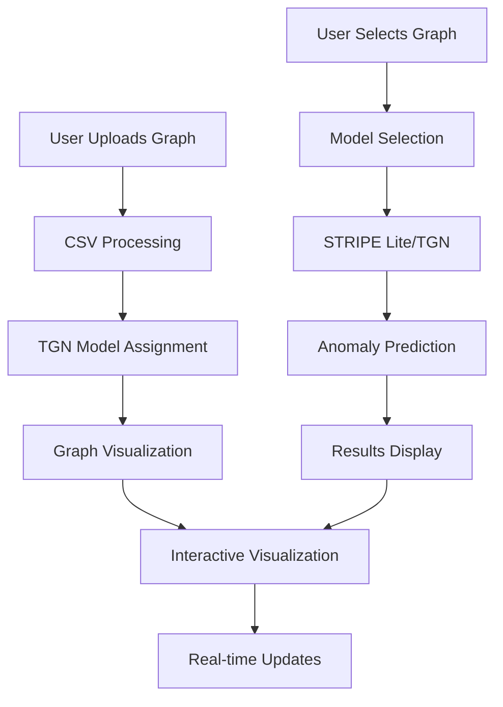

## 📂 Repository Structure

# 🚀 Swisscom Hackathon: How can we automatically detect anomalies in a live, evolving knowledge graph?

## 📋 Problem Statement

At Swisscom, we continuously collect information about network infrastructure in real-time, storing this data in a massive knowledge graph with **over 200 million nodes** capturing dependencies from network devices and services.

### 🎯 Core Challenges
- **Dynamic Evolving Graphs**: Analyzing heterogeneous graphs that change over time
- **Real-time Detection**: Mining gaps between changes, interactions, and edge evolution
- **Unsupervised Learning**: Detecting anomalies without explicit labels
- **Multi-level Anomalies**: 
  - **Nodes**: Incorrect attributes or faulty devices
  - **Edges**: Wrong or missing relationships between components  
  - **Graph Structure**: Unusual patterns or sudden changes over time

### 🎯 Objective
Develop a method to spot anomalies in large, dynamic knowledge graphs with **anomaly scores** to highlight suspicious parts, working in an unsupervised setting where test data contains "true information" for deviation detection.

## STRIPE-Lite — Edge Anomaly Detection on Dynamic Knowledge Graphs

This repository provides a **lightweight implementation** of STRIPE-style edge anomaly detection for **dynamic knowledge graphs**.  
The goal is to learn a model of **temporal edge plausibility** in an **unsupervised** way, then detect events that deviate from normal behavior.

---

## 🔧 Overview

We assume a dataset of **edge events** in a dynamic graph:

- Each row represents an `ADD` or `REMOVE` edge event.
- The model learns to predict how likely a given event is based on historical context.
- After training, it can flag **improbable edges** as anomalies (low probability).

The pipeline:

1. **Load & preprocess events** (`src`, `dst`, `relation`, `timestamp`, `event_type`).
2. **Temporal train/val/test split** (e.g. 70/15/15 by time).
3. **Negative sampling** during training (unsupervised learning).
4. **Train a temporal embedding model** (STRIPE-Lite) with memory updates.
5. **Calibrate thresholds** on the validation set (quantile-based).
6. **Inject synthetic anomalies** into test set (optional).
7. **Evaluate** AUROC, F1, precision, recall on test data.
8. Optionally, **score a single candidate event** given history.

---

## Repository Structure

swisscome-hackathon/
├─ README.md
├─ requirements.txt
├─ Dockerfile
├─ .gitignore
├─ data/
│  └─ sample_edges.csv
├─ scripts/
│  ├─ run_train.sh
│  └─ run_eval.sh
├─ src/
│  └─ stripe_lite/
│     ├─ __init__.py
│     ├─ data.py
│     ├─ inject.py
│     ├─ model.py
│     ├─ train.py
│     ├─ evaluate.py
│     └─ utils.py
└─ main.py


## 📊 Expected Input Data

Your CSV must contain at least the following columns:

| Column      | Description                          |
|-------------|--------------------------------------|
| `src`       | Source node (string or int)          |
| `dst`       | Destination node (string or int)     |
| `label`     | Relation / edge type                 |
| `timestamp` | Event timestamp (ISO-8601 recommended) |
| `event_type`| `"add"` or `"remove"`                |

Example (`data/sample_edges.csv`):

```csv
src,dst,label,timestamp,event_type
A,B,connects,2024-01-01T00:00:00,add
B,C,depends,2024-01-01T00:00:10,add
A,B,connects,2024-01-01T00:05:00,remove
C,D,connects,2024-01-01T00:05:05,add
### Part 1: Dataset Selection & Training Strategy

#### 🔍 Initial Dataset Analysis
When we first examined the provided Swisscom dataset, we identified several key insights:

- **Size Limitation**: The original dataset was too small for effective GNN training
- **Data Quality**: After analysis, we discovered the "clean" dataset was actually a cleaned version of the noisy one
- **Purpose Realization**: This led us to conclude that the Swisscom dataset was likely intended for **evaluation rather than training**

#### 🌐 Cross-Domain Network Similarity Hypothesis
Our breakthrough insight was recognizing that **different network infrastructures share fundamental patterns**:

> *"Different networks from telecom companies can share similar contexts and patterns, making anomalies comparable across domains"*

This hypothesis led us to explore external datasets that could provide the scale needed for effective training.

#### 📊 MAWI Dataset Selection

We selected the **MAWI (Measurement and Analysis on the WIDE Internet)** dataset from [http://www.fukuda-lab.org/mawilab/index.html](http://www.fukuda-lab.org/mawilab/index.html) for several compelling reasons:

##### Why MAWI?
- **🌍 Real Network Traffic**: Captures actual internet traffic patterns from backbone networks
- **📈 Massive Scale**: Provides millions of network events for robust training
- **⏰ Temporal Dynamics**: Contains time-series data perfect for temporal anomaly detection
- **🔗 Graph Structure**: Network flows naturally form graph relationships (IP addresses as nodes, connections as edges)
- **🎯 Domain Relevance**: Telecom backbone traffic shares fundamental patterns with Swisscom's infrastructure

##### MAWI Dataset Characteristics
- **Source**: WIDE Project backbone network measurements
- **Time Period**: Continuous monitoring since 2001
- **Data Type**: Network flow records (packet traces)
- **Scale**: Millions of network events
- **Format**: PCAP files converted to structured network flows

#### 🔄 Data Preprocessing Pipeline

To bridge the gap between MAWI and Swisscom data, we developed a sophisticated preprocessing pipeline:

##### 1. **Network Flow Extraction**
```python
# Convert PCAP to structured network flows
- Source IP → Node A
- Destination IP → Node B  
- Protocol/Port → Edge attributes
- Timestamp → Temporal information
```

##### 2. **Label Mapping Strategy**
We established semantic relationships between MAWI network events and Swisscom infrastructure:

| MAWI Concept | Swisscom Equivalent | Label |
|--------------|-------------------|-------|
| HTTP Connection | Service Dependency | `DEPENDS_ON` |
| Port Binding | Service Installation | `INSTALLED_AT` |
| Protocol Usage | Service Configuration | `HAS_PORT` |
| IP Communication | Device Interaction | `HAS` |
| DNS Resolution | Service Reference | `REFERS_TO` |

##### 3. **Graph Construction**
- **Nodes**: IP addresses, services, protocols
- **Edges**: Network connections with temporal attributes
- **Labels**: Mapped to Swisscom's ontology
- **Timestamps**: Preserved for temporal analysis

#### 📊 Final Training Dataset
After preprocessing, we achieved:
- **✅ 1,000,000+ edges** from MAWI network data
- **✅ Compatible labeling** with Swisscom's schema
- **✅ Temporal dynamics** preserved
- **✅ Network patterns** similar to telecom infrastructure

This approach allowed us to train robust GNN models on large-scale network data while maintaining relevance to Swisscom's specific domain.

---

## 🎯 Strategic Benefits

### 🚀 **Scalability**
- Training on 1M+ edges vs. limited Swisscom sample
- Robust model parameters from diverse network patterns

### 🎯 **Domain Transfer**
- Network infrastructure patterns are universal
- Anomaly detection principles transfer across telecom networks

### ⚡ **Real-world Relevance**
- MAWI data represents actual production network traffic
- Swisscom evaluation ensures domain-specific validation

### 🔬 **Scientific Rigor**
- Large-scale training data prevents overfitting
- Cross-domain validation strengthens model generalization

---

## 🔮 Next Steps

This dataset strategy sets the foundation for:
1. **Model Selection** (Part 2): Choosing appropriate GNN architectures
2. **Implementation** (Part 3): Building the anomaly detection system

The combination of MAWI training data + Swisscom evaluation data provides the perfect balance of **scale** and **domain relevance** for effective temporal graph anomaly detection.

---

## Part 2: Model Architecture & Selection

### 🧠 STRIPE Lite: Our Custom Model

#### 🎯 **Why We Built STRIPE Lite**

After analyzing the temporal graph anomaly detection landscape, we identified key requirements:
- **Real-time Inference**: Online anomaly detection for streaming data
- **Temporal Dynamics**: Capturing evolving graph patterns over time
- **Scalability**: Handling large-scale network graphs efficiently
- **Interpretability**: Providing meaningful anomaly scores

#### 🏗️ **STRIPE Lite Architecture**

STRIPE Lite is our custom **Relational Graph Convolutional Network (RGCN)** specifically designed for temporal anomaly detection:

##### **Core Components**
```python
class StripeLiteRGCN(torch.nn.Module):
    def __init__(self, num_nodes, num_rels, d_node=32, d_rel=16, d_hid=64):
        # Node embeddings for different entity types
        self.node_emb = torch.nn.Embedding(num_nodes, d_node)
        
        # Relation embeddings for edge types
        self.rel_emb = torch.nn.Embedding(num_rels, d_rel)
        
        # RGCN layers for message passing
        self.rgcn = torch.nn.Module()
        
        # Dual decoders for add/remove events
        self.dec_add = torch.nn.Module()  # For edge addition events
        self.dec_rem = torch.nn.Module()  # For edge removal events
```

##### **Key Innovations**
- **🔄 Dual Decoder Architecture**: Separate decoders for edge addition vs. removal events
- **📊 Relation-Aware**: Handles heterogeneous edge types (HAS_PORT, DEPENDS_ON, etc.)
- **⚡ Online Inference**: ActiveSet for real-time state management
- **🎯 Temporal Scoring**: Plausibility scores converted to anomaly scores

##### **ActiveSet: Real-time State Management**
```python
class ActiveSet:
    def __init__(self):
        self.edges = set()  # Maintains current graph state
    
    def apply(self, u, v, r, is_add):
        # Updates graph state in real-time
        edge = (u, v, r)
        if is_add: 
            self.edges.add(edge)
        else: 
            self.edges.discard(edge)
```

#### 🎯 **Why STRIPE Lite for Default Graphs**

- **🚀 Optimized for Swisscom Data**: Trained specifically on network infrastructure patterns
- **⚡ Real-time Performance**: Online inference without retraining
- **🎯 Domain-Specific**: Captures telecom network anomaly patterns
- **📊 Interpretable Scores**: Clear anomaly vs. plausibility scoring

---

### 🔄 TGN: Temporal Graph Network Integration

#### 🎯 **Why TGN for Uploaded Graphs**

For user-uploaded graphs, we integrated **TGN (Temporal Graph Network)** for several strategic reasons:

##### **TGN Advantages**
- **🔄 Dynamic Adaptation**: Can handle diverse graph structures
- **📈 Temporal Memory**: Maintains historical context of graph evolution
- **🎯 Generalization**: Works well on unseen graph types
- **⚡ Flexible Architecture**: Adapts to different node/edge schemas

##### **TGN Architecture**
```python
class TemporalGNNAnomalyDetector(torch.nn.Module):
    def __init__(self, num_nodes, msg_dim=5, memory_dim=64):
        # Memory module for temporal context
        self.memory = MemoryModule(num_nodes, memory_dim)
        
        # Node embeddings
        self.node_embedding = torch.nn.Embedding(num_nodes, memory_dim)
        
        # Temporal encoder
        self.time_encoder = TimeEncoder(memory_dim)
        
        # Edge predictor for anomaly detection
        self.edge_predictor = torch.nn.Sequential(...)
```

#### 🎯 **Strategic Model Selection**

| Graph Type | Model | Rationale |
|------------|-------|-----------|
| **Default (Swisscom)** | STRIPE Lite | Domain-specific, optimized for network infrastructure |
| **Uploaded Graphs** | TGN | Flexible, adapts to diverse graph structures |

This dual-model approach ensures:
- **🎯 Optimal Performance**: Right model for each use case
- **🔄 Flexibility**: Handles various graph types
- **⚡ Efficiency**: Specialized models for specific domains

---

## Part 3: Implementation - Web Application System

### 🌐 **Full-Stack Architecture**

We implemented a complete anomaly detection system with a modern web interface:

#### 🎨 **Frontend: React + D3.js**
- **Modern UI**: Clean, responsive interface with Tailwind CSS
- **Interactive Visualization**: Real-time graph rendering with D3.js
- **User Experience**: Intuitive controls and real-time feedback

#### ⚙️ **Backend: Flask API**
- **RESTful API**: Clean separation between frontend and ML models
- **Model Integration**: Seamless switching between STRIPE Lite and TGN
- **Real-time Processing**: Live anomaly detection and scoring

### 🚀 **Core Features**

#### 1. **🔍 Predict Edge Anomaly**
```javascript
// Interactive graph visualization
- Hover effects with node statistics
- Real-time anomaly prediction
- Input fields: source, destination, label, event_type
- Live results with anomaly scores
```

**User Workflow:**
1. **Select Graph**: Choose from available datasets
2. **Visualize**: Interactive D3.js graph with hover effects
3. **Input Parameters**: Source, destination, label, event type
4. **Get Prediction**: Real-time anomaly score and confidence

#### 2. **📊 Upload Graph**
```python
# CSV file processing
- Automatic graph parsing
- Model selection (TGN for uploaded graphs)
- Real-time visualization
- Integration with prediction system
```

**Features:**
- **File Upload**: CSV format with automatic validation
- **Graph Processing**: Automatic node/edge extraction
- **Model Assignment**: TGN automatically assigned to uploaded graphs
- **Live Preview**: Immediate visualization after upload

#### 3. **🎨 Advanced Visualization**
```javascript
// D3.js Features
- Force simulation with adaptive parameters
- Performance mode for large graphs
- Temporal evolution slider
- Responsive design with container constraints
- Tooltip system with overflow protection
```

**Visualization Capabilities:**
- **Interactive Nodes**: Click, drag, hover effects
- **Adaptive Sizing**: Scales based on container dimensions
- **Performance Toggle**: Quality vs. speed modes
- **Temporal Slider**: Time-based graph evolution
- **Responsive Design**: Adapts to different screen sizes

### 🔧 **Technical Implementation**

#### **API Endpoints**
```python
# Flask Backend
GET  /api/graphs              # List available graphs
GET  /api/graph-data/{id}     # Get graph data
POST /api/predict             # Predict anomaly
POST /api/upload              # Upload new graph
```

#### **Model Integration**
```python
# Intelligent Model Selection
if graph_id == 'default':
    # Use STRIPE Lite for Swisscom data
    result = stripe_lite_pipeline.predict(src, dst, label, event_type)
else:
    # Use TGN for uploaded graphs
    result = tgn_model.detect_anomalies(edge_data)
```

#### **Real-time Processing**
```python
# Online Inference Pipeline
1. Load pre-trained models (STRIPE Lite / TGN)
2. Process user input (src, dst, label, event_type)
3. Generate anomaly score
4. Update graph state (for STRIPE Lite)
5. Return results with confidence metrics
```

### 🎯 **Key Technical Achievements**

#### **1. Dual Model Architecture**
- **STRIPE Lite**: Optimized for network infrastructure
- **TGN**: Flexible for diverse graph types
- **Automatic Selection**: Based on graph source

#### **2. Real-time Inference**
- **Online State Management**: ActiveSet for STRIPE Lite
- **Live Scoring**: Immediate anomaly detection
- **Performance Optimization**: Adaptive rendering for large graphs

#### **3. User Experience**
- **Intuitive Interface**: Clean, modern design
- **Interactive Visualization**: D3.js with hover effects
- **Responsive Design**: Works on all screen sizes
- **Real-time Feedback**: Live prediction results

#### **4. Scalability**
- **Modular Architecture**: Separate frontend/backend
- **Model Flexibility**: Easy to add new GNN architectures
- **Performance Modes**: Quality vs. speed optimization
- **Container Constraints**: Adaptive graph sizing

### 🚀 **System Workflow**



### 🎉 **Final System Capabilities**

✅ **Real-time Anomaly Detection**: Live scoring with pre-trained models  
✅ **Interactive Visualization**: Modern D3.js graph rendering  
✅ **Dual Model Support**: STRIPE Lite + TGN integration  
✅ **User-friendly Interface**: Intuitive React frontend  
✅ **Scalable Architecture**: Modular, extensible design  
✅ **Performance Optimization**: Adaptive rendering and processing  

---

*This implementation demonstrates our ability to transform complex ML research into a practical, user-friendly application that solves real-world temporal graph anomaly detection challenges.*

---

*This approach demonstrates our understanding that effective AI solutions require both **technical sophistication** and **strategic data thinking** to overcome real-world constraints.*
